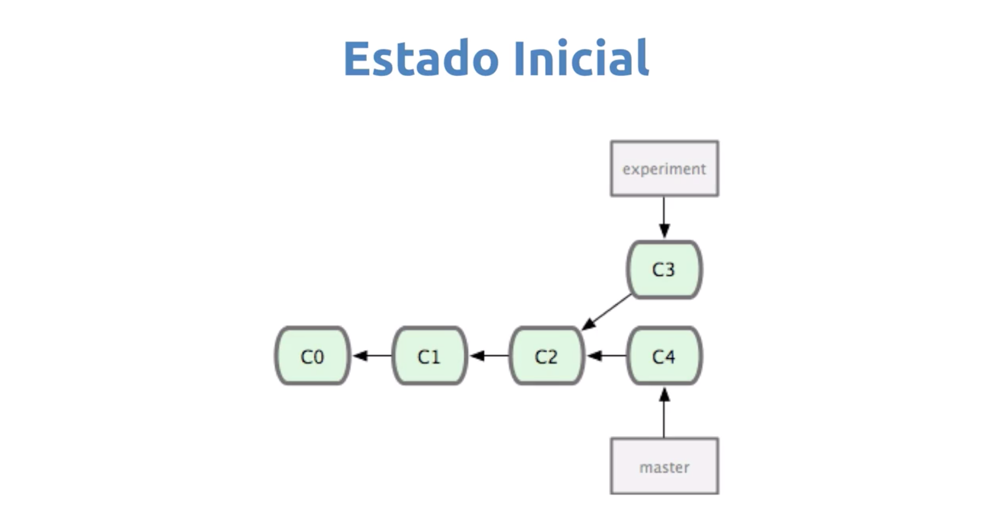

## Unindo branches ##

### Passo a passo do rebase ###
### Estado inicial ###
> Com 2 branches `experiment` e `master` e commits a partir do `C2` criando `C3` e `C4` 

### Durante o processo ###
> Diferente do merge ele coloca em linha ficando `C3'` ficando na frente do `C4`

### Final do rebase ###
> E por fim tanto a branch `master` como `experiment` apontará para o mesmo commit `C3`
](https://github.com/deppbrazil/course-git-e-github-para-iniciantes/blob/master/dist/storage/entendendo-o-rebase.md)

### Pro ### 
* Evita commit extras
* Histórico linear
  
### Contra ###
* Perde a ordem cronológica